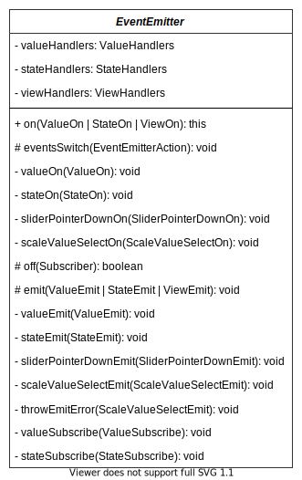

# Slider jQuery-плагин
[](README.md)

A customizable jQuery plugin that implements the functionality of a slider. It is written in TypeScript using MVP architecture and SCSS using CSS custom properties.

## nodejs & jQuery compatibility
To work with the source code of the project and build successfully, a **nodejs** version of at least **12** is required.

To use a ready-made plugin, the **jQuery** library version **3.2.0** or higher must be connected to the page using the plugin.

## npm scripts in package.json
The project has several scripts that simplify the development and testing of the code. Each script is run through the console, and the current path in the console should be the root of the project.

Scripts are run as follows: `npm <script name>` or `npm run <script name>`, e.g.: `npm start`.

Available scripts:

Script name | Destination
--- | ---
start | Launching webpack dev server. The project is being assembled in development mode and a demo page (file dist/demo/demo-page.html ) opens from the local server in the default browser. At the same time, changes in the project files are tracked, which are included in the final build, and when any of these files are changed, the project is quickly reassembled and the demo page opened in the browser is updated.
test | Running all the tests of the project. In fact, it's just running the `jest` command without options. Optionally, after this command, you can specify, separated by a space, which file / test files you want to run. _More details about this can be found in the [Jest framework documentation](https://jestjs.io/docs/cli)._
dev | Building a project in development mode. It is intended for intermediate compilation during development. A quick build without minification of the code and with the addition of a source map (code map) to be able to view the TypeScript source code in the Devtools browser, and in case of an error or warning, the location in the code where it happened. The build result will be saved to the dist folder, while all the previous contents of the folder will be deleted.
build | Building a project in production mode. Designed to receive files ready for publication. It is executed with the minification of the entire code and without adding a source map, all console.warn and console.error outputs are also deleted. The build result will be saved to the dist folder, while all the previous contents of the folder will be deleted.

## Testing
Plugin tests are written using the Jest framework and a little bit of DOM testing library.

To run all the tests, it is enough to run the `npm test` command in the terminal.

To run tests from a specific file, you need to add the name or part of the name of a file or several files with tests to `npm test`. As a result, all test files whose names consist entirely or partially of the specified strings will be launched.

For example, to run tests of only the Model class, you need to run the command `npm test model`

👍 I also highly recommend using the [Jest extension](https://marketplace.visualstudio.com/items?itemName=Orta.vscode-jest) for Visual Studio Code to run tests more conveniently (including file-by-file running and running individual tests and describe blocks), viewing a complete hierarchical list of tests, tracking the status of tests (passed / failed).

## Architecture
The plugin is completely written in TypeScript using the MVP template with passive view.

The main architectural components are Model, Presenter, View and subViews.

### Class structure
Model and Presenter are created in the plugin initializer function, Model is passed to Presenter, View and subViews are created inside Presenter. Model, View and all subviews know nothing about each other or about the Presenter, and can only use their own and inherited properties and methods and can work autonomously.

Model and View are inherited from the abstract EventEmitter class, all subviews are inherited from the abstract SubView class, which is also inherited from EventEmitter.

The Presenter knows about the Model, View, and each subView, and can interact with all of them. Presenter is not inherited from anything, it cannot work without Model, View and subView classes.

Logger is a class used in development mode by the Model, EventEmitter classes and the plugin initialization function for advanced output and storage of error messages and warnings that may occur during plugin initialization and during its operation.

Panel is a class for demonstrating dynamic customization of the plugin on a demo page. It takes in an instance of the plugin during initialization, receives its options and creates its own elements on the page with values depending on the settings of the received plugin. It also subscribes to all plugin events and creates handlers for all its elements to pass their values to the plugin.

### UML diagram of class structure
Click on the image to go to the original and view it in full screen.
[](https://github.com/riskoviv/slider/raw/experimental/class-diagram.drawio.svg)

### The device of the mechanism of internal subscription to events and notifications about them
Presenter can access all public properties and methods of other classes, including the `on` method (inherited from the EventEmitter class), which allows it to subscribe to events of these classes.

When calling this method, 2 arguments are passed: the name of the event to which the subscription is performed and the function that will be called when the event is triggered.

All classes that generate events can notify the subscriber (Presenter) about the event by calling their `emit` method (inherited from the EventEmitter class). New data is passed to the emit method (the new value of the changed option or data from the DOM event), which is then passed as an argument (number, boolean value or object) to the subscriber function from the Presenter.

Model, View and subViews can only transmit data to Presenter and only via the `emit` method.

Presenter can pass data to other classes either by writing directly to their public properties, or by calling their public methods.

### The sequence of internal actions performed during initialization
The function initializing the plugin (`sliderPlugin`) checks the object argument passed to it with the values of custom options, and if any of the options are incorrect, they are ignored and default values are used for these options.

In the same function, a Model is created, to which a ready-made object with options is passed for further verification and saving in the model options.

Then a Presenter is created, 2 arguments are passed to its constructor: the jQuery element on which the plugin initialization method was called, and the newly created Model.

Inside the Presenter, the View and all the subviews needed in the initial state of the slider are created (depending on the options). The Presenter also subscribes to all possible Model, View and subView events. Then, by calling public methods, Presenter passes to View the initial values of those state options, in case of inclusion of which it is necessary to add modifier classes to the root element of the slider to set suitable styles. The Presenter also initializes ResizeObserver to update the scale element in case it needs to display fewer or more clickable elements on it, and for possible merging/disconnecting of floating hints.

After initializing the Presenter, public methods for dynamic customization of the slider are added to the root element of the slider created inside the View, using them you can change any of the [options](#api) of the plugin. Methods are also added for subscribing / unsubscribing other HTML page elements or callback functions to slider events.

The 'slider-plugin` plugin initialization method eventually returns JQuery\<HTMLElement>, which you can interact with by calling methods on it to change options or subscribe/unsubscribe.

The events that the View can react to are DOM events:
- **pointerdown** (with a possible further **pointermove**) on the `div.slider__control-container` element, while the Event.target object at pointerdown can be either the control-container itself or the thumb (`div.slider__thumb_1` or `_2`)
- **pointerdown** on `span.slider__scale-text` elements

Events generated inside the Model can be called by all public plugin customization methods if valid values are passed to them.

Presenter reacts to all events from Model and subView.

When an event is triggered by a subView, Presenter processes the data received from the subView and performs all the necessary actions and writes changes to the options in the Model.

Model checks the received data before sending the event and writes it to the options, and only then calls the event, which catches the Presenter and passes the changed values to the View to display the changes on the slider.

## Subscribing to events
The plugin allows you to subscribe to its events that occur when options change. Each event is associated with a single option value.

To subscribe to an event, you need to call the `subscribe` method on the plugin element returned by the `sliderPlugin` initialization function. The subscribe method takes 2 arguments:
1. [Event name](#api)
2. Subscriber. It can be:
   1. When subscribing to a change event of **a numeric value** – an element `<input type="number">` or a function that accepts 1 argument of type **number**
   2. When subscribing to a **state** change event – an element `<input type="checkbox">` or a function that accepts 1 argument of the **boolean type**

Example of subscribing an HTML element `<input type="number">` to a value change event:
```js
// a virtual element is used here,
// but an element located on the page can also be used in the same way
const inputNumberElement = document.createElement('input');
inputNumberElement.type = 'number';
const slider2 = $('#slider2').sliderPlugin();
slider2.subscribe('value2Changed', inputNumberElement);
// now, when the value2Changed event is triggered on the slider2 slider,
// the value contained in this element will be replaced with the new value2 slider value
```
Example of subscribing an HTML element `<input type="checkbox">` to a state change event:
```js
const inputCheckboxElement = document.querySelector('input[type="checkbox"]');
const slider3 = $('#slider3').sliderPlugin();
slider3.subscribe('isIntervalChanged', inputCheckboxElement);
```
Example of subscribing a function to a plugin event:
```js
// saving an instance of the plugin to the variable slider1
const slider1 = $('#slider1').sliderPlugin();
let changeableValue;

// in order to be able to unsubscribe this function from the event later,
// you need to save it in advance to a variable (numberCallback in this case)
const numberCallback = (value1) => { changeableValue = value1 };

// the value of the changeableValue variable will change to the new value1 value
// in the callback function when the value1Changed event is triggered
slider1.subscribe('value1Changed', numberCallback);
```

### ⚠ A note about subscribing an element using the API
If the subscribed HTML element will also be used as an element whose value will change some value in the plugin *(passed at the input/change event by the handler function to the plugin API method, as in the case of inputs in panels on the demo page)*, an extra plug-in's API method call may occur with the transfer of the already just changed value to it.

However, this is not a very big problem, because inside the plugin there is a check of each value coming into it from the outside, and if this value does not differ from the current one, it will not overwrite the current one, it will not be returned to subscribers and the input/change event will not be triggered on the subscriber; looping the return of the value from the plugin and writing to the plugin not happening.

But it is still recommended to prevent this by checking the `isSubscribeSet` property on the event object. For example:

```typescript
const sliderPlugin5 = $('#slider5').sliderPlugin();
// we supplement the event interface with the isSubscribeSet property
// to check its value in the handler
interface SubscribeSetEvent extends Event {
  isSubscribeSet?: boolean;
}
const minInputListener = (e: SubscribeSetEvent) => {
  // pass the new input value to the plugin only if the change in the input value
  // is not caused by the plugin itself, but in some other way
  if (!e.isSubscribeSet) {
    sliderPlugin5.setMinValue(e.target.valueAsNumber));
  }
}
const minValueInput = document.querySelector('.panel__input[data-role="min"]');
// the input, when changing its value, will change the minValue of the plugin
minValueInput.addEventListener('input', minInputListener);
// and at the same time it will be a subscriber of the plugin's minValue
sliderPlugin5.subscribe('minValueChanged', minValueInput);
```

## Unsubscribe from events
Subscribed functions and HTML elements can be unsubscribed from events to which they were previously subscribed. There are two ways to do this:
1. Pass a previously signed element/function to the plugin's `unsubscribe` method:
   ```js
   slider1.unsubscribe(numberCallback);
   ```
2. Call the unsubscribe method on the signed HTML element or function itself:
   ```js
   inputNumberElement.unsubscribe();
   ```
*Each subscriber can be subscribed to only one event, and when using any of the two unsubscribe methods, the element or function will be found in the subscribers' repository, so when unsubscribing, it is not needed to specify from which event it needs to be unsubscribed.*

## Using the plugin
- To the HTML page where you want to use the plugin, connect the jQuery library file. For example, by writing the following in the `<head>` section:

  ```html
  <script src="https://code.jquery.com/jquery-3.6.0.min.js"></script>
  ```
- In the same place, connect the plugin script file `slider-plugin.js` to your page using the `script` tag:
  ```html
  <script defer src="./slider-plugin.js"></script>
  ```
  and its `slider-plugin.css` styles using the `link` tag:
  ```html
  <link href="./slider-plugin.css" rel="stylesheet">
  ```
- The plugin is created on an object of type `JQuery<HTMLElement>` by calling the `sliderPlugin()` method on this element.

  ⚠ The HTML element on which the plugin will be created must have fixed dimensions, because the slider does not have its own dimensions and adapts to the dimensions of the element in which it is contained. Moreover, in the horizontal slider mode, only the width (css property width) must be defined for the container element, and in the vertical mode only the height (height css property).

  Create a plugin with [**standard** options](#api) is possible if you call the plugin initialization method without arguments:
  ```js
  $('#slider').sliderPlugin();
  ```
  Where `#slider` is the selector of your element on the page, inside which the slider will be placed. ⚠ With this, all the contents of this element, if any, will be completely deleted.
- The initial state of the plugin can be customized with custom option values.
  To do this, you need to pass an object with options as an argument to the plugin initialization method:
  ```js
  $('#slider').sliderPlugin({ isVertical: true, stepSize: 5 });
  ```
  Default values will be used for options that are missing in the passed object.

## Removing a plugin
Removing a plugin can be done by calling the `destroySlider` method on the plugin instance or on the HTML element containing it. Calling this method clears the slider container element, removes the root element and all API methods from the plugin instance, and freezes the object with options.

Examples:
```js
const slider7Container = $('#slider7');
const slider7Instance = slider7Container.sliderPlugin();

// removing by calling a method on an instance
slider7Instance.destroySlider();

// removing by calling a method on a container
// the method is called NOT on the jQuery object, but on the HTML element itself
slider7Container[0].destroySlider();
// or
document.querySelector('#slider7').destroySlider();
```

## API
**Options** are properties of an object accepted as the only argument by the plugin initialization function. There are 2 types of options: state options that store boolean values, and numeric options that store number values.

It is also possible to call methods on an instance of the created plugin returned by the initialization function, which can change the values of all plugin options. All methods are described in the last columns of the tables below. Each method takes one boolean or number argument, depending on the type of option it changes (methods that change state options take a boolean argument; methods that change numeric options take a number argument).

### Examples of using API methods
```js
const slider6 = $('#slider6').sliderPlugin();
// changing of maxValue to 30
slider6.setMaxValue(30);
// enabling of scale
slider6.setShowScale(true);
// you can also concatenate methods in an unlimited number
// in this example, the vertical mode is enabled and the minValue is changed to 0
slider6.setVerticalState(true).setMinValue(0);
```

### Options, events, and methods of state values
Take a value of type `boolean`, by default all have the value `false`

Option | Description | Event that occurs when this option is changed | API method that changes this option
--- | --- | --- | ---
`isVertical` | horizontal / vertical view | `isVerticalChanged` | `setVerticalState`
`isInterval` | single value (1 thumb) / interval (2 thumbs) | `isIntervalChanged` | `setInterval`
`showTip` | whether to show a floating hint above the thumb (or thumbs, if there are 2 of them) | `showTipChanged` | `setShowTip`
`showScale` | whether to show a scale with acceptable values under the slider, taking into account the step | `showScaleChanged` | `setShowScale`
`showProgressBar` | whether to show the progress bar: if a single value then from the beginning of the slider to the thumb, if an interval then from the first to the second thumb | `showProgressChanged` | `setShowProgress`

### Numeric value options, events, and methods
They take a value of the type `number`, by default all options have their own value

Option | Default value | Description | Event that occurs when this option is changed | API method that changes this option
--- | --- | --- | --- | ---
`stepSize` | 10 | the size of the step by which the thumbs can move starting from the minimum value | `stepSizeChanged` | `setStepSize`
`minValue` | -100 | minimum slider value | `minValueChanged` | `setMinValue`
`maxValue` | 100 | maximum slider value | `maxValueChanged` | `setMaxValue`
`value1` | -50 | the first value, it is indicated by the first thumb | `value1Changed` | `setValue1`
`value2` | 50 | the second value is indicated by the second thumb | `value2Changed` | `setValue2`


### Other methods
Method name | Description
--- | ---
`getOptions` | Does not accept arguments, returns a plugin options object with values **at the time of calling** of the method. ⚠ When the plugin options are changed later, the values in the resulting object may not be relevant.
